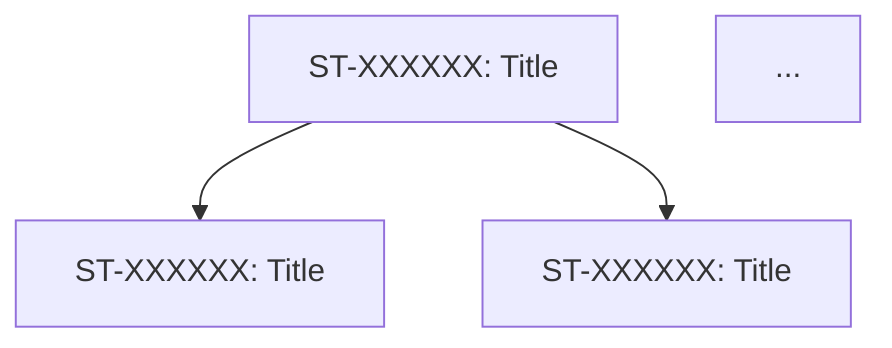

# Analyst Workflow

Triggered by: `"analyze requirement: <brief description>"` or `"analyze <brief description>"` in CLAUDE.md

The text after the trigger keyword is the user's **initial requirement context**. If no context is provided, the orchestrator asks the user for a one-line description before starting.

**Output folder:** `/result/analyst/`

> **Independence note:** All output documents are written to be useful to any development team — they do not assume the reader is using this devkit. Avoid agent-speak, devkit-specific references, or placeholders in final documents.

---

## Pipeline State

The orchestrator maintains `.claude/agents/tmp/analyst_workflow_state.md` to support resumption after unexpected termination.

**On pipeline start — always check this file first:**
- If the file **exists** → read it and resume from the recorded stage
- If the file **does not exist** → start fresh from Stage 1

**State file format:**
```markdown
# Analyst Workflow State
**Topic:** <brief description of the requirement>
**Stage:** <1 | 2a | 2b | 2c>
**Question Count:** <N>
**Discussion Cycle:** <0 | 1 | 2>
**Sessions:**
- ba_session: <agentId or empty>
- tl_session: <agentId or empty>
- po_session: <agentId or empty>
**Updated:** YYYY-MM-DDTHH:MM
```

**Write rules:** Create at Stage 1 entry. Update `Stage` + `Updated` after each transition. Update `Sessions` on spawn only. Update `Question Count` each Q&A turn. Delete after Stage 2c completes.

---

## Stage 1 — Requirements Elicitation (Orchestrator-led, Interactive)

The orchestrator conducts the entire Q&A loop directly using the natural conversation context, which persists across turns for free. **No BA agent is spawned during elicitation.** BA is spawned exactly once at the end of Stage 1 to formalise the spec into documents.

### How the interaction works

1. Orchestrator reads `.claude/agents/business_analyst_instructions.md` to internalise the BA questioning approach and domain knowledge
2. Orchestrator extracts the initial requirement context from the trigger message
3. Orchestrator asks the user **exactly one question** — grounded in the initial context, not generic
4. User answers; orchestrator increments `Question Count` in the state file
5. Orchestrator asks the next question, explicitly building on all prior answers
6. Repeat steps 4–5 until the orchestrator judges it has sufficient information for a complete spec (all features, constraints, open decisions, and non-functional requirements covered)
7. Orchestrator writes the full Q&A log to `/result/analyst/elicitation_notes.md`
8. **Spawn** BA agent; save its `agentId` as `ba_session`
9. BA reads `business_analyst_instructions.md` + its memory files + `elicitation_notes.md`
10. BA writes:
    - `spec.md` — the full elicited specification
    - `business_requirements.md` — structured requirements (functional, non-functional, constraints, assumptions, open items)
11. BA reports completion to the orchestrator (max 5 bullets)
12. Orchestrator updates state to Stage 2a and proceeds

### Stage 1 rules
- **One question per turn** — orchestrator must never ask multiple questions in a single message
- Each question must explicitly build on the user's previous answers
- Orchestrator must not make assumptions or fill in unstated details — ask instead
- Orchestrator writes `elicitation_notes.md` after the final answer, before spawning BA
- BA in steps 9–11 only writes documents — it does not ask the user any further questions

---

## Stage 2 — Multi-agent Analysis & Planning

BA, TL, and PO analyse the spec and engage the user directly with clarifying questions and suggestions. Agents are encouraged to propose better or alternative solutions — not just implement what was literally stated.

### Shared file convention

| File | Writer | Purpose |
|---|---|---|
| `elicitation_notes.md` | Orchestrator (read-only in Stage 2) | Full Q&A log from Stage 1 |
| `spec.md` | BA (read-only after Stage 1) | Full elicited specification |
| `business_requirements.md` | BA | Structured requirements: functional, non-functional, constraints, assumptions, open items |
| `architecture.md` | TL | Architecture choices, component design, data handling, error handling, alternatives considered. Inline Mermaid diagrams for component/relationship views. References PlantUML diagram files in `diagrams/` for workflow and sequence views. |
| `testing_plan.md` | TL | Testing strategy: unit, integration, E2E, acceptance criteria hints |
| `implementation_roadmap.md` | PO | Phased implementation plan: release goal, sprint breakdown, stories with AC in devkit story standard format, dependency graph, release criteria, risks |
| `discussion.md` | TL + PO (shared write) | Questions needing user input and suggestions for the user to consider |
| `summary.md` | TL (Stage 2c) | Human-readable overview: what is being built, architecture diagram, key decisions, roadmap table, open items |
| `diagrams/` | TL | PlantUML `.puml` files for workflow and sequence diagrams |

### Diagram conventions

**Use Mermaid (inline in markdown) for:**
- Component and service relationship diagrams (`graph LR`, `graph TD`)
- Entity relationship diagrams
- State machines
- High-level architecture overview in `summary.md`

**Use PlantUML (separate `.puml` files in `diagrams/`) for:**
- API request/response sequence diagrams
- Detailed workflow and process flows
- Deployment and infrastructure diagrams
- Any diagram where PlantUML syntax is significantly clearer than Mermaid

Each `.puml` file must be referenced from the relevant markdown document with a relative link and a brief caption, e.g.:

```markdown

> *Diagram: user_auth_flow.puml — User authentication sequence from request to response*
```

The agent writing the diagram decides which format to use based on what communicates the design most clearly for that specific diagram.

### `discussion.md` format

Each agent writes under its own named sections. BA does not write to this file.

```markdown
## TL Questions
<!-- Questions TL cannot resolve from the spec alone -->
- QUESTION: <question text>

## TL Suggestions
<!-- Proactive suggestions: better approaches, alternatives, trade-offs -->
- SUGGEST: <suggestion with rationale and trade-offs>

## PO Questions
<!-- Questions PO cannot resolve from the spec alone -->
- QUESTION: <question text>

## PO Suggestions
<!-- Proactive suggestions: scope alternatives, priority trade-offs, MVP adjustments -->
- SUGGEST: <suggestion with rationale and trade-offs>
```

Agents omit a section entirely if they have nothing to add to it.

---

### Stage 2a — Initial Analysis (TL and PO in parallel)

1. **Spawn** TL agent and PO agent in the **same orchestrator message** — they run in parallel
   - Save TL `agentId` as `tl_session`; save PO `agentId` as `po_session`
2. TL reads `spec.md` + `business_requirements.md`:
   - Writes `architecture.md` covering: architecture choices, component design, data handling details, error handling strategies, and any alternatives considered. Embeds Mermaid diagrams inline. Writes PlantUML diagrams as separate `.puml` files under `diagrams/` and links them from `architecture.md`.
   - Writes `testing_plan.md` covering: unit, integration, E2E layers, acceptance criteria hints
   - **Proactively suggests** better technical solutions or trade-offs the user may not have considered — writes these to `discussion.md` under `## TL Suggestions`
   - Writes unresolvable questions to `discussion.md` under `## TL Questions`
3. PO reads `spec.md` + `business_requirements.md`:
   - Writes `implementation_roadmap.md` (see format below)
   - **Proactively suggests** scope simplifications, MVP trade-offs, or phasing alternatives — writes these to `discussion.md` under `## PO Suggestions`
   - Writes unresolvable questions to `discussion.md` under `## PO Questions`
4. Both agents report completion to the orchestrator (max 5 bullets each)
5. Orchestrator proceeds to Stage 2b

#### `implementation_roadmap.md` format

The PO writes this document in the same style as a Scrum implementation roadmap. Stories use the devkit story standard format so they are ready to be created as GitHub Issues in any project.

```markdown
# {Feature/Project Name} — Implementation Roadmap

**Product:** {project name}
**Feature / Scope:** {brief scope description}
**Timeline:** {design phase} + {N sprints} ({M weeks total})
**Delivery Date:** ~{M} weeks from start

---

## Release Goal

{1–2 sentences. What does the team deliver? What problem is solved for the end user?}

---

## Sprint Planning Overview

| Phase | Duration | Focus | Story Points | Deliverable |
|-------|----------|-------|--------------|-------------|
| **Design** | Week N | API / design spec | N pts | {deliverable} |
| **Sprint 1** | Week N–N | {focus area} | N pts | {deliverable} |
| ... | | | | |

---

## Design Phase: {Title} (Week N)

**Goal:** {goal sentence}
**Story Points:** N

> **Standard:** {any design-first rules relevant to the project}

### [ST-XXXXXX] {Story Title In Title Case}
**Points:** N | **Priority:** P0/P1/P2 | **Assigned:** {Developer | Technical Lead | QA | Business Analyst}

**Acceptance Criteria:**
- [ ] {criterion}
- [ ] {criterion}

**Dependencies:** {none or list}

---

## Sprint N: {Title}

**Goal:** {goal sentence}
**Story Points:** N

### [ST-XXXXXX] {Story Title}
**Points:** N | **Priority:** P0/P1/P2 | **Assigned:** {role}

**Acceptance Criteria:**
- [ ] {criterion}

**Dependencies:** {none or story IDs}

---

## Dependency Graph

{Mermaid flowchart showing story dependencies across phases and sprints}



---

## Release Criteria

**Must Have:**
- [ ] {criterion}

**Should Have:**
- [ ] {criterion}

**Nice to Have:**
- [ ] {criterion}

---

## Risks & Mitigations

| Risk | Likelihood | Impact | Mitigation |
|------|-----------|--------|-----------|
| {risk} | High/Medium/Low | High/Medium/Low | {mitigation} |

---

## Glossary

| Term | Definition |
|------|-----------|
| {term} | {definition} |
```

**PO rules for the roadmap:**
- Story IDs are placeholders (`ST-XXXXXX`) — real IDs are assigned when GitHub Issues are created
- AC should be high-level and testable — detailed implementation tasks belong in the story comments, not the roadmap
- Every story must have an `**Assigned:**` field matching one of the five agent roles
- Include a Glossary section for domain terms that a new developer would not know

---

### Stage 2b — User Discussion (questions and suggestions)

1. Orchestrator reads `discussion.md`; if the file does not exist or is empty → skip to Stage 2c
2. **Spawn or resume** BA via `ba_session`; BA reads `discussion.md` and answers only the questions it can definitively resolve from `spec.md` and `business_requirements.md` — writes answers inline beneath each question; marks unanswerable questions `NEEDS_USER`; does not touch the `Suggestions` sections
3. Orchestrator collects all remaining `NEEDS_USER` questions and all `SUGGEST` items from `discussion.md`
4. Orchestrator presents each item to the user **one at a time** in this order: questions first, then suggestions
   - For questions: ask the user directly and record the answer
   - For suggestions: present the suggestion with its rationale and ask the user to accept, reject, or modify
5. After all items are addressed, orchestrator **resumes TL and PO in parallel** (via saved sessions or spawns new) with a summary of all user answers and decisions; TL and PO update their documents accordingly
6. Orchestrator increments `Discussion Cycle` in the state file
7. **Loop limit:** Max 2 discussion cycles. After cycle 2 → orchestrator records any remaining unresolved items as open decisions and continues to Stage 2c

---

### Stage 2c — Final Review (BA) + Developer Summary (TL)

**BA finalises requirements:**

1. **Spawn or resume** BA via `ba_session`
2. BA reads all output documents (`business_requirements.md`, `architecture.md`, `testing_plan.md`, `implementation_roadmap.md`) and the resolved `discussion.md`
3. BA updates `business_requirements.md` to reflect any decisions made during Stage 2b
4. BA reports completion to the orchestrator (max 5 bullets)

**TL writes human-readable summary:**

5. **Resume** TL via `tl_session` (spawn new if expired); TL reads all finalised output documents and writes `/result/analyst/summary.md`.

   **Writing goal:** Anyone — developer, product manager, or stakeholder — who has never seen this feature should be able to read `summary.md` alone and understand what is being built, why the architecture is shaped the way it is, and what the delivery plan looks like. Write in plain language — no agent-speak, no placeholder prose. Every section must contain real content.

   **Required structure:**

```markdown
# {Feature/Project Name} — Summary

> {One sentence describing the feature from a user's perspective.}

## Background
{2–4 sentences. Why does this feature exist? What problem does it solve? What triggered it?}

## Architecture Overview

{1–2 sentences introducing the diagram — what it shows and why the system is structured this way.}

{Mermaid diagram. Choose the type that best communicates the design:
- `flowchart TD` for request/data flow
- `graph LR` for component relationships
- `sequenceDiagram` for interaction between services/actors
The diagram must be accurate to architecture.md — do not simplify to the point of being misleading.}

{If a PlantUML diagram in diagrams/ is more appropriate for a specific view, reference it here with a relative link and caption.}

## Key Technical Decisions

{For each significant decision, write a short paragraph. Explain what was decided, what the alternatives were, and why this choice was made.}

**{Decision title}**
{2–3 sentences: what, why, and what was rejected.}

## Delivery Plan

{Brief narrative paragraph summarising scope and timeline, followed by the sprint table.}

| Phase | Duration | Focus | Points | Key Deliverable |
|-------|----------|-------|--------|-----------------|
| Design | Week N | {focus} | N | {deliverable} |
| Sprint 1 | Week N–N | {focus} | N | {deliverable} |

## Non-Functional Requirements
{Only include NFRs with real implications for how code is written — performance budgets, security constraints, data isolation rules. Skip generic boilerplate.}

- **{NFR}:** {specific constraint or target}

## Open Items
{Decisions not resolved during the workflow. List each as an actionable question with an owner. Write "None" only if genuinely nothing is left open.}

- **{question}** — Owner: {TL / PO / BA}
```

6. TL reports completion to the orchestrator (max 5 bullets)
7. Orchestrator reports the list of all output documents to the user, highlighting `summary.md` as the human-readable starting point
8. Orchestrator deletes `analyst_workflow_state.md`

---

## Pipeline Rules

- **No agent spawning during Stage 1 Q&A** — orchestrator conducts elicitation directly; BA is spawned once only at the end of Stage 1 to write documents
- **Parallel spawning** — TL and PO are always spawned in a single orchestrator message in Stage 2a; never sequentially
- **One item at a time** — orchestrator presents exactly one question or suggestion per turn in all user-facing interaction (Stage 1 and Stage 2b)
- **Agents engage users directly** — in Stage 2b, TL and PO questions and suggestions go to the user without BA acting as a gatekeeper; BA only filters what it can answer from the spec
- **Suggest, don't just implement** — TL and PO must look beyond the literal spec and surface better alternatives; silence on a clearly improvable point is a miss
- **Diagram format ownership** — the agent writing the diagram chooses Mermaid or PlantUML based on what communicates the design most clearly for that specific diagram; PlantUML diagrams are always separate `.puml` files in `diagrams/`, never inline
- **File ownership** — TL and PO write to `discussion.md`; BA answers questions inline but does not write suggestions; `spec.md` and `elicitation_notes.md` are read-only in Stage 2
- **Loop limit** — max 2 discussion cycles in Stage 2b before recording open items and continuing
- **Stop on blocker** — if any agent reports a blocking issue, orchestrator stops and reports to the user before continuing
- **Completion reports** — each agent returns max 5 bullets to the orchestrator; details go in Working Records
- **Independence** — output documents must not reference devkit internals; they must be readable and actionable by any development team

---

## Output Documents

All documents are written to `/result/analyst/` and remain there after the workflow completes.

| Document | Audience | Contents |
|---|---|---|
| `summary.md` | **Everyone (start here)** | Human-readable overview: background, architecture diagram, key decisions, delivery plan, open items |
| `architecture.md` | Developer / TL | Architecture choices, component design, data handling, error handling, alternatives considered. Inline Mermaid diagrams + links to PlantUML files. |
| `implementation_roadmap.md` | Dev / PO | Phased plan: release goal, sprint breakdown, stories with AC, dependency graph, release criteria, risks, glossary |
| `testing_plan.md` | Dev / QA | Testing strategy: unit, integration, E2E, acceptance criteria hints |
| `business_requirements.md` | All | Structured requirements: functional, non-functional, constraints, assumptions, open items |
| `spec.md` | BA / PO | Full formalised specification written by BA |
| `elicitation_notes.md` | Reference | Full Q&A log from Stage 1 |
| `diagrams/*.puml` | Developer / TL | PlantUML source files for workflow, sequence, and infrastructure diagrams |
